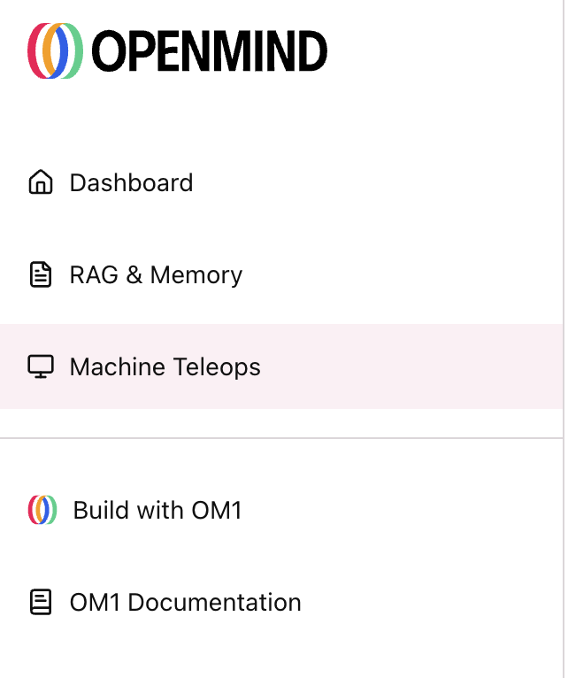
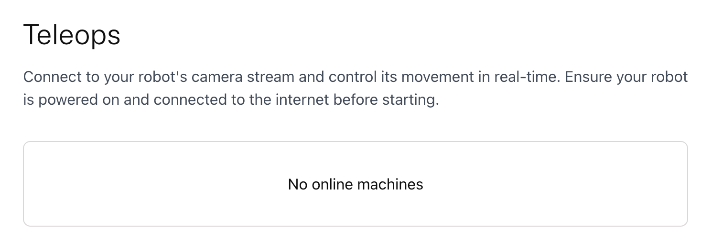
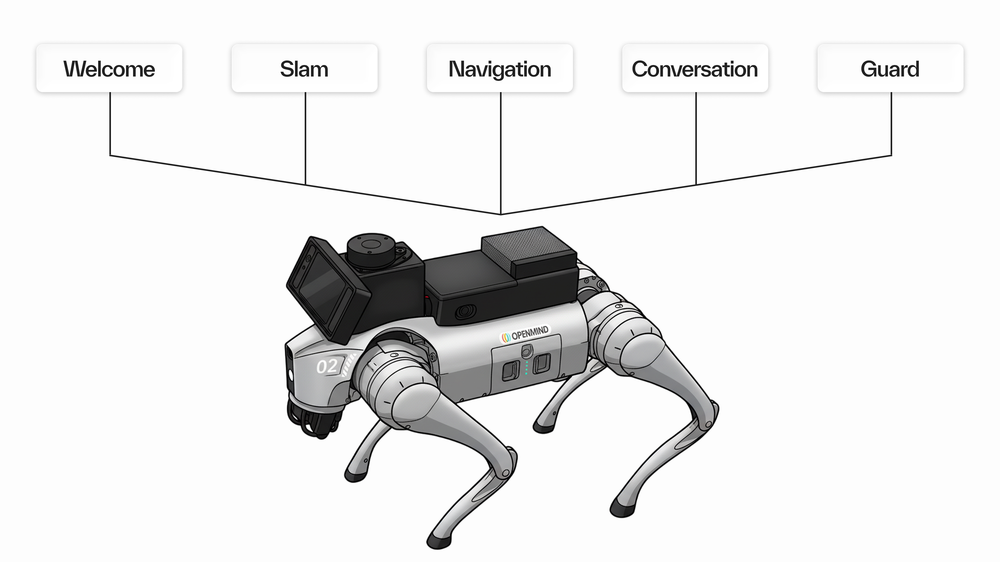

Once your Go2 is setup to run in full autonomy, you can get started with exploring different modes offered via OM1 and explore the functionalities.
There are two ways to do this:
1. Voice commands
2. Via Portal

## Voice commands

Step 1: Configure your API key in `unitree_go2_modes.json5` file and run it.
Step 2: Start talking to your robot dog and ask it to switch to a particular mode.
    For example, 
    The robot says, hi I'm your friendly robot dog, how may I help you?
    The user can then request the robot to switch to a particular mode by saying, switch to [desired mode].

- Desired mode: **Welcome** 
    trigger_keywords: ["reset", "start over", "welcome mode", "restart", "initialize"]
- Desired mode: **Conversation** 
    trigger_keywords: ["talk", "chat", "conversation", "tell me", "ask you", "discuss"]
- Desired mode: **Slam** 
    trigger_keywords: ["explore", "map", "navigate", "look around", "slam", "wander"]
- Desired mode: **Navigation** 
    trigger_keywords: ["navigate", "navigation", "go to", "take me to", "show me"]
- Desired mode: **Guard** 
    trigger_keywords: ["guard", "security", "patrol", "keep watch"]

## Portal

Step 1: Configure your API key in `unitree_go2_modes.json5` file and run it.
Step 2: Login to your OM1 portal and head over to Machine Teleops on the left navigation bar.
    
Step 3: 
    
  